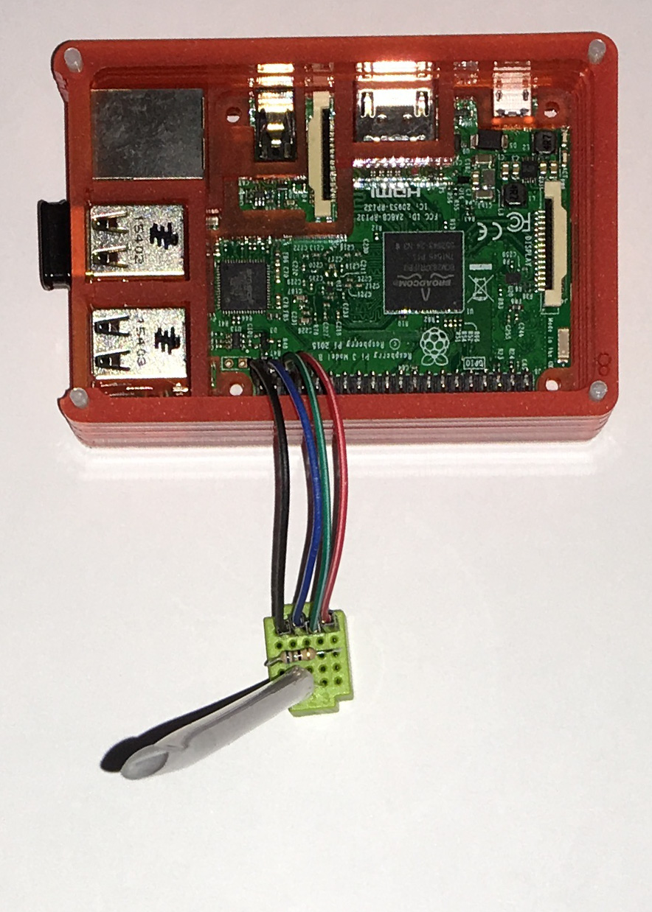
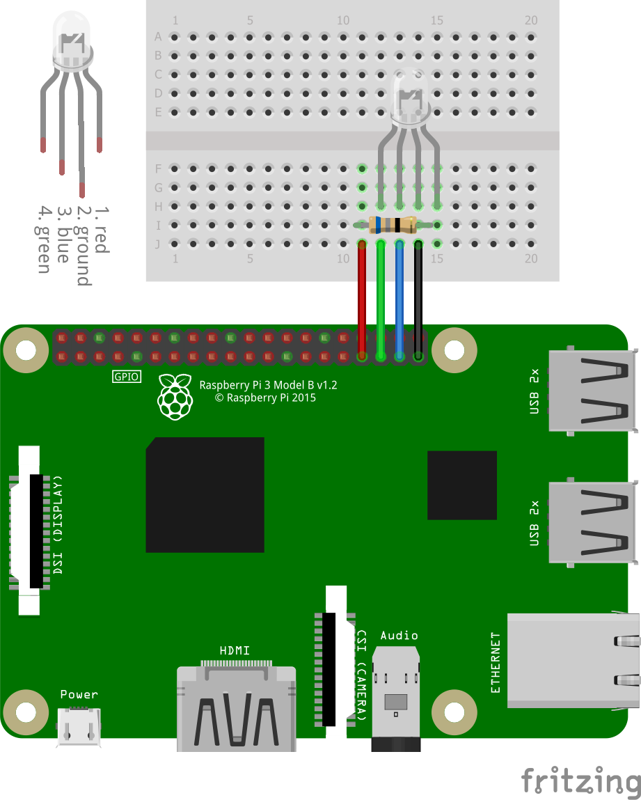

# Raspberry-pi-led-lightsaber
A "lightsaber" (colour-changing LED) tutorial using the Raspberry Pi 3 (courtesy of [Cotswold Jam](http://www.cotswoldjam.org/)). The original files can be found [here](http://cotswoldjam.org/downloads/2018-09/).

The code uses the [GPIOZero](https://github.com/RPi-Distro/python-gpiozero/) library with some accompanying Python 2 code (seems to work with Python 3 too) and the following components:

* 4 male-female GPIO jumper cables (also called DuPont cables, preferably of different colours)
* 1 breadboard (a small 5×5 breadboard works well, but any size is fine)
* 1 68Ω (blue grey black) resistor
* 1 4-pin colour-changing LED

For this tutorial I recommend using [IDLE (Python 2.7)](https://www.python.org/downloads/), however you can also try running the code with Python 3 using [Thonny](http://thonny.org/) or IDLE (Python 3.5).

To setup the lightsaber, do the following (refer to the Fritzing diagram below or in the PDF):

1. Connect the 4 jumper cables from the GPIO pins 13, 19, 26 and GND (last four bottom right pins, assuming the USB and Ethernet ports are to the right) to the bottom left four holes of the breadboard. I recommend trying to use the colour cables that match the diagram exactly, though any colour combination can be used.

2. Connect the 68Ω resistor by placing one connector into the first pin and another into the last pin of the row above the jumper cables.

3. Connect the colour-changing LED to the 4 holes on the right of the last row, make sure that the longest pin (the ground) is lined up with the black cable so the LED is properly grounded.

4. Run each of the Python scripts in order, which are `lightsaber.py`, `ls1.py`, `ls2.py` and `ls3.py`. Try altering the code and see if you can make your own colour combinations.

## Licensing
Cotswold Jam tutorial code and instructions are in the public domain. To simplify things, I have formally licensed the code and documenation in this repository under the **Creative Commons Zero 1.0 Universal (CC0 1.0)**.

The [GPIO pin diagram](https://www.raspberrypi.org/documentation/usage/gpio/) is courtesy of the Raspberry Pi Foundation and used under the **Creative Commons ShareAlike 4.0 (CC-BY-SA)**.

## And FINALLY
If you love this tutorial, please drop a [donation](https://www.PayPal.me/cotswoldjam) to Cotswold Jam. :-)

## Photos and diagrams

")
